# 🔄 Complete Document Processing Workflow Guide

This guide walks you through the complete document processing workflow from raw documents to structured business intelligence using the Documents Processor ecosystem.

## 📋 **Workflow Overview**

The Documents Processor provides a comprehensive pipeline for transforming raw documents into structured, actionable business intelligence:

```mermaid
graph TD
    A[📁 Raw Documents] --> B[🧹 Cleanup & Preparation]
    B --> C[📄 Document Processing]
    C --> D[📊 Batch Report Generation]
    D --> E[🤖 AI Structured Extraction]
    E --> F[💼 Business Intelligence]
    
    style A fill:#e1f5fe
    style B fill:#f3e5f5
    style C fill:#e8f5e8
    style D fill:#fff3e0
    style E fill:#fce4ec
    style F fill:#e0f2f1
```



---

## 🚀 **Phase 1: Preparation**

### **1.1 Environment Setup**

```bash
# Ensure virtual environment is activated
source venv/bin/activate  # Linux/macOS
# or
venv\Scripts\activate     # Windows

# Install all dependencies
pip install -r requirements.txt

# Set up API key for AI features (optional)
echo "OPENAI_API_KEY=your_api_key_here" > .env
```

### **1.2 Optional Pre-Cleanup**

Clean any leftover files from previous processing sessions:

```bash
# Interactive cleanup with preview
python cleanup_utility.py --preview

# Automatic cleanup with backup
python cleanup_utility.py --all --backup
```

**What gets cleaned:**
- `images/` - Previous extracted images
- `media_for_processing/` - Temporary media files  
- `tables/` - Previous CSV table exports
- `processing_cache/` - AI processing cache
- `structured_results/` - Old structured analysis results

**Protected files (never deleted):**
- `processed_documents/complete_processing_report.md`
- `processed_documents/processing.log`
- `config/settings.json`
- `config/prompts/default_prompt.txt`

---

## 📄 **Phase 2: Document Processing**

### **2.1 Single Document Processing**

For processing individual documents:

```python
from documents_processor import Document

# Process a single document
doc = Document("path/to/your/document.pdf")
doc.process()

# Access results
print("Extracted text:", doc.text_content)
print("Found images:", doc.images)
print("Extracted tables:", doc.tables)
```

**Supported formats:**
- **Documents**: PDF, DOCX, DOC, RTF, TXT, MD, ODT, EPUB
- **Spreadsheets**: XLSX, XLS, CSV
- **Presentations**: PPTX, PPT
- **Images**: JPG, PNG, HEIC, HEIF, GIF, TIFF, BMP
- **Archives**: ZIP, RAR (with recursive processing)
- **Apple formats**: Pages, Numbers (macOS)

### **2.2 Batch Document Processing**

For processing entire document collections:

```python
from documents_processor import batch_process_folder

# Process entire folder with automatic cleanup
results = batch_process_folder(
    input_folder="documents/",
    output_file="processed_documents/complete_processing_report.md",
    auto_cleanup=True,  # Automatically clean before processing
    preview_chars=None  # Include full content in report
)
```

**Auto-cleanup behavior:**
- Cleans `images/`, `media_for_processing/`, `tables/`, `processing_cache/`
- Preserves protected files
- Logs cleanup statistics
- Continues processing even if cleanup fails

### **2.3 Command Line Processing**

Using the convenient batch processing script:

```bash
# Process all documents in a folder
python process_all_to_markdown.py input_folder/

# With custom output location
python process_all_to_markdown.py input_folder/ --output custom_report.md

# Disable automatic cleanup
python process_all_to_markdown.py input_folder/ --no-cleanup
```

---

## 📊 **Phase 3: Structured Analysis**

### **3.1 AI-Powered Structured Extraction**

Transform processing reports into structured business intelligence:

```bash
# Basic structured extraction
python structured_report_processor.py

# Custom prompt for specific data extraction
python structured_report_processor.py --prompt analysis_prompt

# Process specific report file
python structured_report_processor.py --input my_report.md --output results.json

# List available prompts
python structured_report_processor.py --list-prompts
```

### **3.2 Programmatic Structured Processing**

For integration with business systems:

```python
from structured_report_processor import StructuredReportProcessor

# Initialize processor
processor = StructuredReportProcessor()

# Process with automatic cleanup of old results
result = processor.process_report(
    input_file="processed_documents/complete_processing_report.md",
    prompt_name="default_prompt",
    model="gpt-4.1-mini"
)

# Access structured data
summary = result["results"]["summary"]
findings = result["results"]["key_findings"]
file_count = result["results"]["total_files_processed"]
```

### **3.3 Custom Prompts for Specific Use Cases**

Create custom prompts in `config/prompts/` for specific business needs:

```bash
# Create custom prompt
echo "Extract financial data from reports..." > config/prompts/financial_prompt.txt

# Use custom prompt
python structured_report_processor.py --prompt financial_prompt
```

---

## 🔄 **Phase 4: Integration & Automation**

### **4.1 Complete Automated Workflow**

Full automation from documents to structured data:

```python
import os
from documents_processor import batch_process_folder
from structured_report_processor import StructuredReportProcessor
from cleanup_utility import cleanup_before_batch_processing

def complete_processing_workflow(input_folder: str, output_prefix: str = "analysis"):
    """Complete document processing and analysis workflow"""
    
    # 1. Pre-processing cleanup
    print("🧹 Cleaning previous processing artifacts...")
    cleanup_stats = cleanup_before_batch_processing(
        target_directories=['images', 'media_for_processing', 'tables'],
        exclude_protected=True,
        silent=False
    )
    print(f"Cleaned {cleanup_stats['deleted_files']} files")
    
    # 2. Batch document processing
    print("📄 Processing documents...")
    report_file = f"processed_documents/{output_prefix}_processing_report.md"
    batch_process_folder(
        input_folder=input_folder,
        output_file=report_file,
        auto_cleanup=False  # Already cleaned above
    )
    
    # 3. Structured analysis
    print("🤖 Extracting structured information...")
    processor = StructuredReportProcessor()
    structured_results = processor.process_report(
        input_file=report_file,
        output_file=f"processed_documents/{output_prefix}_structured_results.json"
    )
    
    print("✅ Complete workflow finished!")
    return structured_results

# Usage
results = complete_processing_workflow("input_documents/", "monthly_analysis")
```

### **4.2 Business System Integration**

Export structured data to business systems:

```python
import json
import pandas as pd

# Load structured results
with open("processed_documents/structured_results_20241230_140000.json", 'r') as f:
    data = json.load(f)

# Extract key findings for business reporting
findings_df = pd.DataFrame(data["results"]["key_findings"])

# Export to Excel for business users
findings_df.to_excel("business_reports/key_findings.xlsx", index=False)

# Create summary dashboard data
dashboard_data = {
    "total_files": data["results"]["total_files_processed"],
    "file_types": data["results"]["file_types_found"],
    "processing_date": data["metadata"]["processing_timestamp"],
    "key_insights_count": len(data["results"]["key_findings"])
}

# Save dashboard data
with open("business_reports/dashboard_data.json", 'w') as f:
    json.dump(dashboard_data, f, indent=2)
```

---

## 🔧 **Advanced Configuration**

### **5.1 Processing Configuration**

Customize processing behavior via `config/settings.json`:

```json
{
  "default_model": "gpt-4.1-mini",
  "timeout_seconds": 120,
  "temperature": 0,
  "auto_cleanup_old_results": true,
  "cache_settings": {
    "enabled": true,
    "default_ttl_hours": 24
  },
  "input_settings": {
    "default_input_file": "processed_documents/complete_processing_report.md",
    "max_input_size_mb": 50
  },
  "output_settings": {
    "output_directory": "processed_documents",
    "filename_template": "structured_results_{timestamp}.json",
    "pretty_print": true
  }
}
```

### **5.2 Environment Variables**

Control document processing limits:

```bash
# Document processing limits
export MAX_DOCUMENT_PAGES=20
export DISABLE_PAGE_LIMIT=false

# Vision API configuration
export MAX_VISION_CALLS_PER_PAGE=50

# OpenAI API key for image descriptions
export OPENAI_API_KEY=your_api_key_here
```

### **5.3 Cleanup Configuration**

Fine-tune cleanup behavior:

```python
from cleanup_utility import cleanup_before_batch_processing

# Custom cleanup configuration
cleanup_stats = cleanup_before_batch_processing(
    target_directories=[
        'images',
        'processing_cache',
        'structured_results'  # Pattern-based cleanup
    ],
    exclude_protected=True,
    create_backup=True,
    silent=False
)
```

---

## 📈 **Performance Optimization**

### **6.1 Caching Strategy**

The system uses multi-level caching for optimal performance:

1. **Memory Cache**: Fast access for recently processed items
2. **Disk Cache**: Persistent storage in `processed_documents/processing_cache/`
3. **TTL Management**: Automatic expiration of stale cache entries

### **6.2 Large Document Collections**

For processing large document collections:

```python
# Process in batches
import os
from pathlib import Path

def process_large_collection(input_dir: str, batch_size: int = 50):
    """Process large document collections in batches"""
    
    all_files = list(Path(input_dir).rglob("*"))
    document_files = [f for f in all_files if f.is_file() and not f.name.startswith('.')]
    
    for i in range(0, len(document_files), batch_size):
        batch_files = document_files[i:i+batch_size]
        batch_dir = f"temp_batch_{i//batch_size + 1}"
        
        # Create temporary batch directory
        os.makedirs(batch_dir, exist_ok=True)
        for file in batch_files:
            shutil.copy2(file, batch_dir)
        
        # Process batch
        batch_process_folder(
            input_folder=batch_dir,
            output_file=f"processed_documents/batch_{i//batch_size + 1}_report.md"
        )
        
        # Cleanup temporary directory
        shutil.rmtree(batch_dir)
```

### **6.3 Memory Management**

For memory-efficient processing:

```python
# Use preview mode for large collections
results = batch_process_folder(
    input_folder="large_collection/",
    preview_chars=1000,  # Limit text content in report
    return_docs=True     # Return data instead of writing large report
)

# Process results incrementally
for doc_data in results:
    # Process individual document data
    process_single_document(doc_data)
```

---

## 🔍 **Troubleshooting**

### **7.1 Common Issues**

**LibreOffice not found:**
```bash
# macOS
brew install --cask libreoffice

# Ubuntu/Debian
sudo apt install libreoffice

# Set custom path
export SOFFICE_PATH=/path/to/soffice
```

**Memory issues with large files:**
```bash
# Set document page limits
export MAX_DOCUMENT_PAGES=10
export DISABLE_PAGE_LIMIT=false
```

**API timeout issues:**
```json
{
  "timeout_seconds": 300,
  "cache_settings": {
    "enabled": true,
    "default_ttl_hours": 48
  }
}
```

### **7.2 Log Analysis**

Monitor processing through logs:

```bash
# View processing logs
tail -f processed_documents/processing.log

# Search for errors
grep "ERROR" processed_documents/processing.log

# Monitor cleanup operations
grep "cleanup" processed_documents/processing.log
```

### **7.3 Cache Management**

Manage processing cache manually:

```python
from cleanup_utility import cleanup_before_batch_processing

# Clear only cache files
cleanup_stats = cleanup_before_batch_processing(
    target_directories=['processing_cache'],
    exclude_protected=True,
    silent=False
)

# Clear all temporary files but preserve reports
cleanup_stats = cleanup_before_batch_processing(
    target_directories=['images', 'media_for_processing', 'tables'],
    exclude_protected=True,
    create_backup=True
)
```

---

## 📊 **Business Use Cases**

### **8.1 Financial Document Analysis**

```python
# Process financial documents
results = complete_processing_workflow("financial_docs/", "q4_financial")

# Extract financial data
financial_findings = [
    finding for finding in results["results"]["key_findings"]
    if finding["category"] in ["data", "document"]
]
```

### **8.2 Legal Document Review**

```python
# Use custom legal prompt
processor = StructuredReportProcessor()
legal_analysis = processor.process_report(
    prompt_name="legal_review_prompt",
    output_file="legal_analysis_results.json"
)
```

### **8.3 Research Data Extraction**

```python
# Process research documents with high detail
results = batch_process_folder(
    input_folder="research_papers/",
    preview_chars=None,  # Full content
    auto_cleanup=True
)

# Extract structured research data
research_results = processor.process_report(
    prompt_name="research_extraction_prompt"
)
```

---

## 🚀 **Next Steps**

1. **Customize Prompts**: Create domain-specific prompts in `config/prompts/`
2. **Automate Workflows**: Set up scheduled processing for regular document analysis
3. **Integrate Systems**: Connect structured outputs to business intelligence tools
4. **Scale Processing**: Implement batch processing for large document collections
5. **Monitor Performance**: Use caching and cleanup strategies for optimal performance

For additional support and advanced configurations, see the complete documentation in the `docs/` directory.